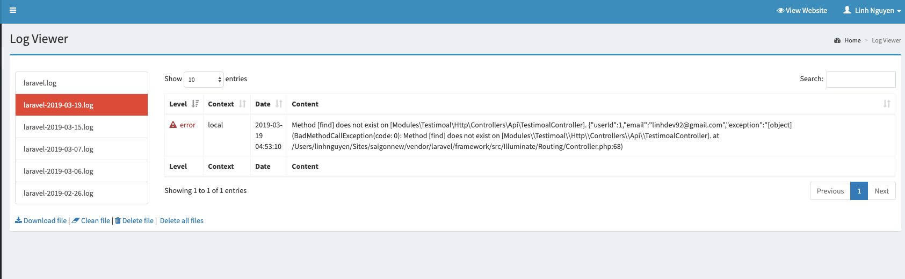

# Log Viewer Module
Simple Module, custom from rap2hpoutre/laravel-log-viewer

## Installation
### Module Download
Using AsgardCMS's module download command:

`php artisan asgard:download:module linhdev92/logviewer`
This will download the module.

This is the recommended way if you wish to customise the views, etc.
### Composer
`composer require linhdev92/logviewer`

Atfer download it, you should go to Role in module User for permission it

## Screenshot

